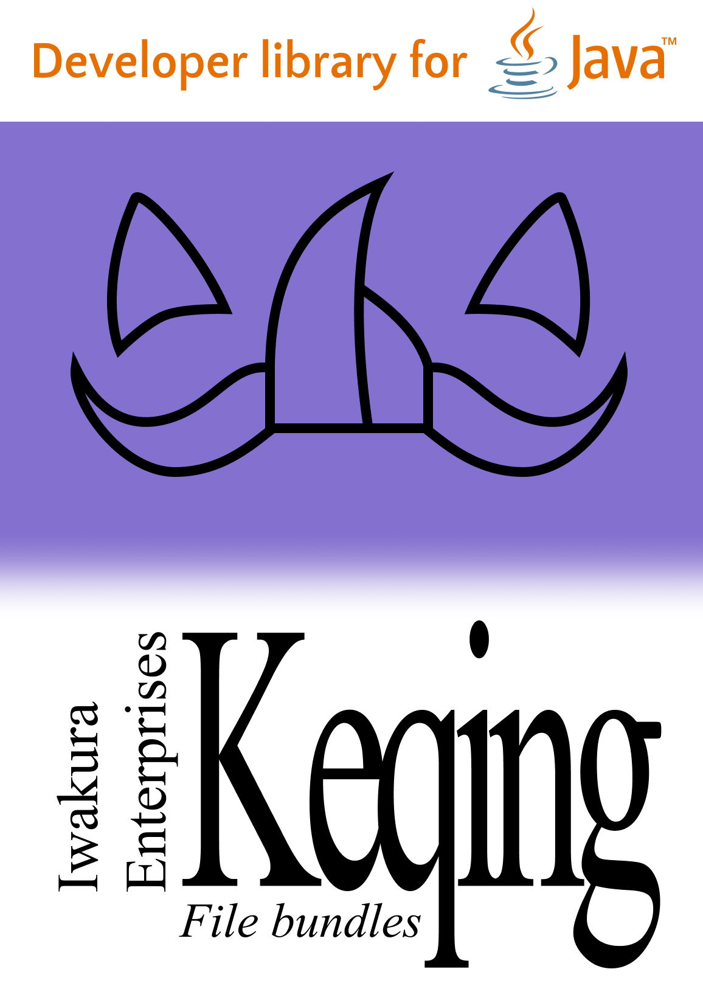

  

# Keqing

Simple library handling file bundles. Fear not of missing translations or complex configuration files,
Keqing will handle it for you.

> Disclaimer: The library name and design is not related to any character in any game or media.

## Project structure
- `keqing-core`: Core library that provides file bundle handling functionality.
- `keqing-gson`: Implementation of Keqing's serialization system for GSON
- `keqing-snakeyaml`: Implementation of Keqing's serialization system for SnakeYAML

## Documentation

Documentation is available at the [Central iwakura.enterprises documentations](https://docs.iwakura.enterprises/keqing.html)
